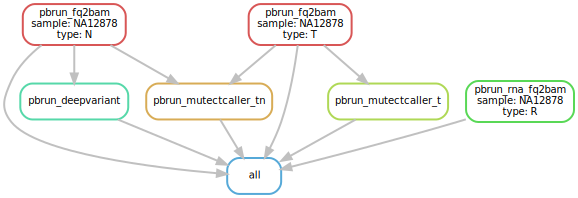

# :snake: hydra-genetics/parabricks

#### Snakemake module containing an array of steps provided by the parabricks tookit


[](https://opensource.org/licenses/gpl-3.0.html)

## :speech_balloon: Introduction

The module contains rules to align `.fastq`-files and call variants in the resulting
`.bam`-files using [Clara Parabricks](https://docs.nvidia.com/clara/parabricks/4.0.1/).
To use this module a server with access to one or more [compatible NVIDIA GPUs](https://docs.nvidia.com/clara/parabricks/4.0.1/GettingStarted.html#installation-requirements) is required. Input data should be trimmed `.fastq`-files and we recommend to generate
these with `hydra-genetics/prealignment` for a smooth transition. In order to make
use of read group information, add machine, flowcell and library specifics to
`units.tsv`.

## :heavy_exclamation_mark: Dependencies

In order to use this module, the following dependencies are required:

[](https://github.com/hydra-genetics/)
[](https://pandas.pydata.org/)
[](https://docs.nvidia.com/clara/parabricks/4.0.0/index.html)
[](https://www.python.org/)
[](https://snakemake.readthedocs.io/en/stable/)

## :school_satchel: Preparations

### Sample and unit data

Input data should be added to [`samples.tsv`](https://github.com/hydra-genetics/prealignment/blob/develop/config/samples.tsv)
and [`units.tsv`](https://github.com/hydra-genetics/prealignment/blob/develop/config/units.tsv).
The following information need to be added to these files:

| Column Id | Description |
| --- | --- |
| **`samples.tsv`** |
| sample | unique sample/patient id, one per row |
| tumor_content | ratio of tumor cells to total cells |
| **`units.tsv`** |
| sample | same sample/patient id as in `samples.tsv` |
| type | data type identifier (one letter), can be one of **T**umor, **N**ormal, **R**NA |
| platform | type of sequencing platform, e.g. `NovaSeq` |
| machine | specific machine id, e.g. NovaSeq instruments have `@Axxxxx` |
| flowcell | identifer of flowcell used |
| lane | flowcell lane number |
| barcode | sequence library barcode/index, connect forward and reverse indices by `+`, e.g. `ATGC+ATGC` |
| fastq1/2 | absolute path to forward and reverse reads |
| adapter | adapter sequences to be trimmed, separated by comma |

### Reference data

Reference files should be specified in `config.yaml` in the section `reference`.
A `.fasta`-file is needed as well as a `.vcf` file containing known indels used
during the alignment process. For the RNA alignment part, `genome_dir` should
specify a directory containing reference files generated by
[STAR](https://github.com/alexdobin/STAR/blob/master/doc/STARmanual.pdf).

## :rocket: Usage

To use this module in your workflow, follow the description in the
[snakemake docs](https://snakemake.readthedocs.io/en/stable/snakefiles/modularization.html#modules).
Add the module to your `Snakefile` like so:

```bash
module parabricks:
    snakefile:
        github(
            "hydra-genetics/parabricks",
            path="workflow/Snakefile",
            tag="1.0.0",
        )
    config:
        config


use rule * from parabricks as parabricks_*
```

### Compatibility

Latest:
 - prealignment:v1.1.0

 See [COMPATIBLITY.md](../main/COMPATIBLITY.md) file for a complete list of module compatibility.

### Output files

The following output files should be targeted via another rule:

| File | Description |
|---|---|
| `parabricks/pbrun_deepvariant/{sample}.vcf` | variant call file generated by deepvariant |
| `parabricks/pbrun_fq2bam/{sample}_{type}.bam` | alignment file generated by BWA-mem |
| `parabricks/pbrun_mutectcaller_t/{sample}_T.vcf` | variant call file generated by Mutect2 using tumor-only mode |
| `parabricks/pbrun_mutectcaller_tn/{sample}.vcf` | variant call file generated by Mutect2 using tumor/normal mode |
| `parabricks/pbrun_rna_fq2bam/{sample}_R.bam` | alignment file generated by STAR |

## :judge: Rule Graph


